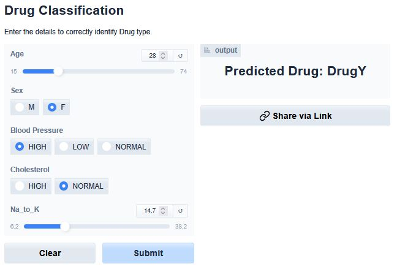

## Drug Classification - CI/CD Implementation
* Goal: Utilize CI/CD methods to create a live application.
* Results. <a href="https://jedh2-drug-classification.hf.space/?__theme=system">Link</a>

### Summary :speaker:
* App overview
* Stack
* Data
* Model
* Applications

### App overview 
* The app takes the inputs (Age, Sex, Blood Pressure, Cholesterol, sodium to potassium levels) and uses the model to predict an output drug (A, B, C, X, Y).

  

### Stack
* Random Forest Model - Python, scikit-learn, skops
* CI/CD - GitHub Actions, Make
* Frontend - Gradio, Hugging Face

### The Data :bar_chart:
* The dataset is from Kaggle. https://www.kaggle.com/datasets/prathamtripathi/drug-classification

### Data Modeling :bar_chart:
* Used Random Forest Classifier
* Achieved F1 = 0.99 and accuracy = 0.98

### Applications:
This model can be utilized by healthcare organizations to predict drug administration in patients with specific illnesses.
